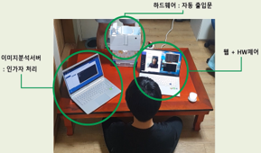
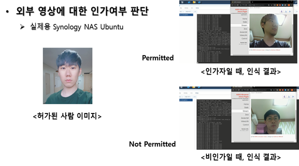

# Access-Control-System_IoT-Project-FaceRecog

> 4학년 1학기 IoT시스템제어 수업에서 진행한 얼굴인식을 이용한 출입통제시스템 연구 및 개발 프로젝트 중 이미지분석서버부

## 개발기간
* 2020.03.02.~06.19. (약3개월)

## 주요 기능
* 머신러닝을 이용하여 얼굴인식 수행
* 인가여부에 따라 개폐함
    * 회전문 모형은 3D프린팅하여 제작함
* 웹을 통해 모니터링 가능
* 출입이력 DB 관리

## 담당한 부분
* 이미지분석서버 구축
    * 시놀로지 NAS의 도커 프로그램으로 우분투 환경 구축
* 얼굴인식 기능 구현
    * OpenCV 라이브러리를 사용한 머신러닝을 통해 샘플이미지를 통해 출입허가자를 인식
* 상세내용은 링크 참조 

<https://drive.google.com/file/d/1_fNF1vIoBFb_I2gWsFUBhKb82Ky-JM6o/view?usp=sharing>

## Development setup
* OS: Ubuntu 16.04
* Framework: OpenCV 3.3

## Release History

* 1.0.0
    * first
    * 개발 완료

## Contact

김준혁 – kimjunhyeok.it@gmail.com
